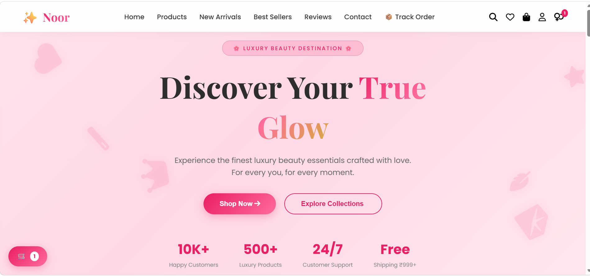
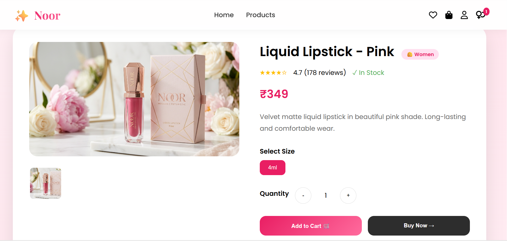
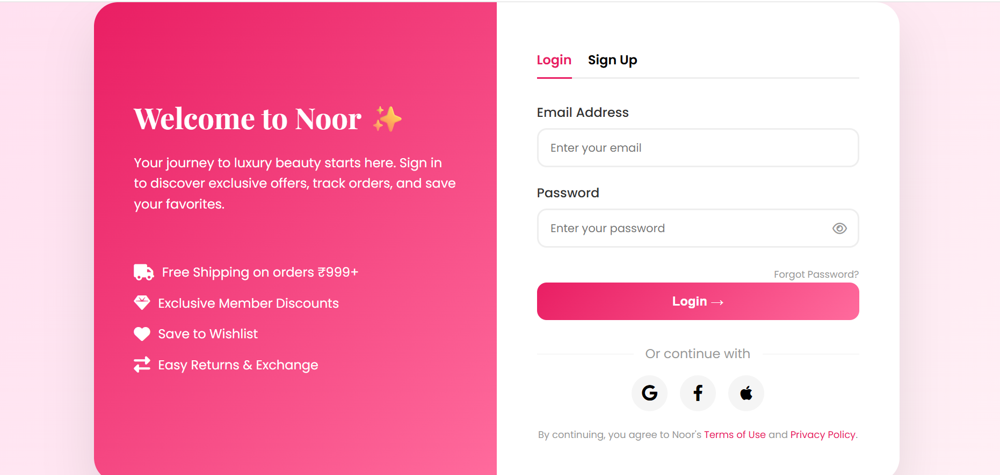
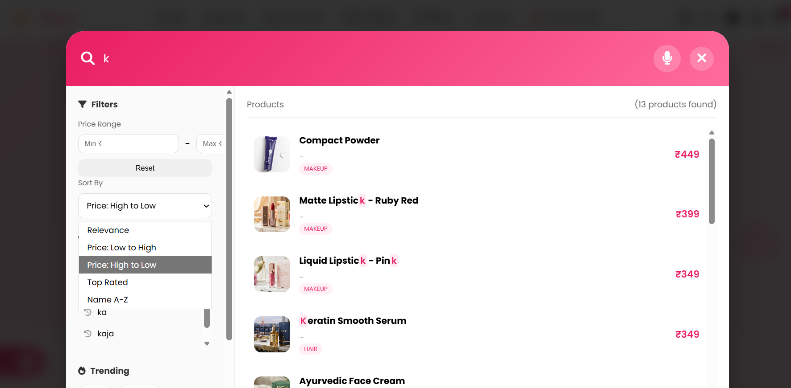
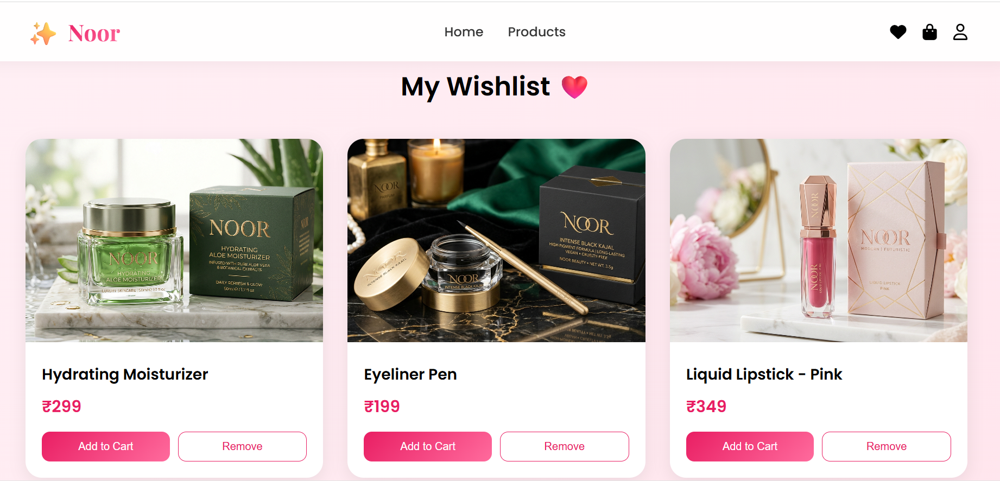

# ✨ Noor – Luxury Beauty & Cosmetics Website

> “For every YOU!” – A modern and responsive beauty e-commerce website built using HTML, CSS, and JavaScript.

---

## 🌸 Project Overview

**Noor** is a luxury beauty and cosmetics shopping website designed to provide users with a smooth, elegant, and interactive online shopping experience.  
The website includes product browsing, shopping cart management, checkout system, contact support, coupon discounts, responsive UI, and many modern web features.

This project was developed as a **Mini Project** for academic purposes and demonstrates front-end web development skills using core web technologies.

---

# 📌 Project Title

### Noor – Luxury Beauty Destination Website

---

# 🎯 Purpose of the Website

The main purpose of this website is to create an attractive and user-friendly online platform where customers can:

- Explore beauty and skincare products
- Add products to cart and wishlist
- Apply discount coupons
- Place orders online
- Contact support easily
- Experience a responsive and modern shopping interface

The project also helps in understanding:
- Front-end website development
- UI/UX design principles
- Form validation
- Local storage handling
- Responsive web design
- Interactive JavaScript functionality

---

# 🛠 Technologies Used

| Technology | Purpose |
|------------|---------|
| HTML5 | Website structure |
| CSS3 | Styling and responsive design |
| JavaScript | Dynamic functionality and validations |
| Font Awesome | Icons |
| Google Fonts | Modern typography |
| LocalStorage API | Storing cart/orders data |

---

# ✨ Main Features of Website

## 🏠 Home Page
- Attractive luxury-themed UI
- Animated hero section
- Product showcase sections
- Responsive navigation bar
- Floating elements and smooth effects

## 🛍 Product Section
- Display of beauty products
- Product details and pricing
- Add to Cart functionality
- Wishlist support

## 🛒 Shopping Cart System
- Dynamic cart management
- Quantity increase/decrease
- Remove products from cart
- Automatic total calculation
- Free shipping logic

## 💳 Checkout System
- Customer information form
- Country → State → City selection
- Payment method selection
- Coupon code system
- Order summary calculation
- Form validation

## 🎟 Coupon & Discount System
- Multiple coupon codes
- Percentage and flat discounts
- Free shipping coupons
- Real-time discount updates

## 📦 Order Management
- Order ID generation
- Order summary storage
- Estimated delivery information
- Order confirmation process

## 📞 Contact Page
- Interactive contact form
- Form validation
- FAQ section
- Google Maps integration
- Customer support details

## 🤖 Chatbot Assistant
- Simple AI-style assistant
- Quick customer support replies
- Interactive chat interface

## 📱 Responsive Design
- Mobile-friendly layout
- Tablet and desktop support
- Adaptive sections and navigation

---

# 🔄 Website Flow / Working

Home Page
   ↓
Browse Products
   ↓
Add Products to Cart
   ↓
Manage Cart Items
   ↓
Proceed to Checkout
   ↓
Fill Customer Details
   ↓
Apply Coupon (Optional)
   ↓
Choose Payment Method
   ↓
Place Order
   ↓
Order Confirmation

---
# 📸 Screenshots

## 🏠 Homepage

## ✨ Product Detail Page

## 🔐 Login Page

## 🔍 Search Page

## ❤️ Wishlist Page

---

# ✅ Conclusion

The **Noor Luxury Beauty Website** successfully demonstrates the implementation of a modern and responsive e-commerce frontend website using HTML, CSS, and JavaScript.

This project helped in improving practical knowledge of:
- Frontend web development
- Responsive UI design
- JavaScript functionality
- Form validation
- Shopping cart systems
- Interactive user experience

The website provides a premium luxury shopping experience with modern UI elements and user-friendly navigation.

---

# 👩‍💻 Developed By

**[Shruti V. Darji]**

Mini Project Submission
